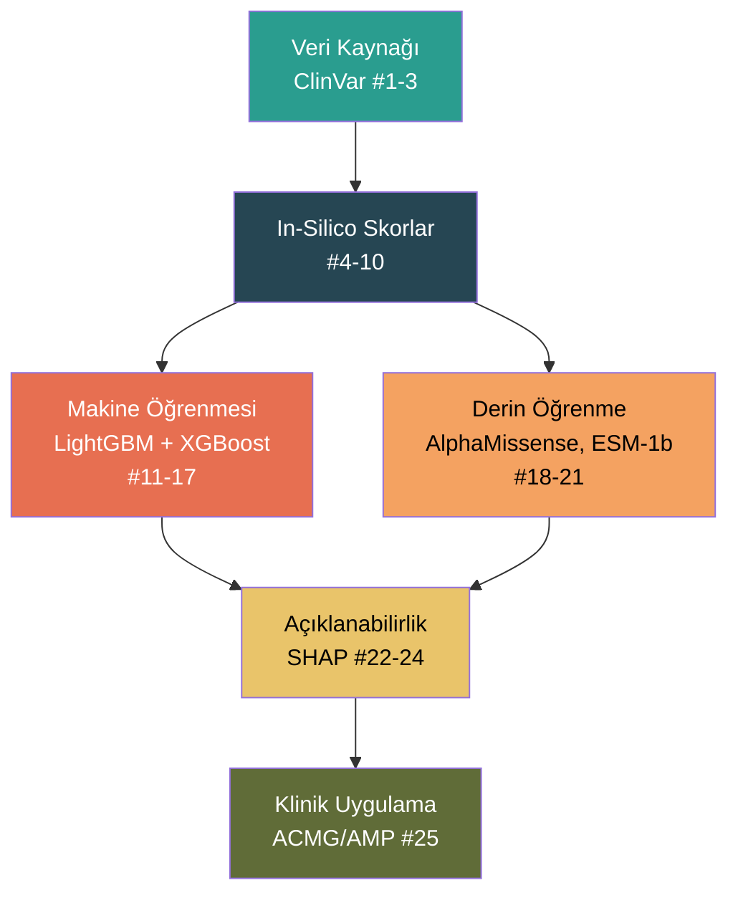

# Missense Varyant Patojenite Sınıflandırması – Literatür Taraması

> **Proje:** TEKNOFEST 2026 – Sağlıkta Yapay Zeka Yarışması  
> **Konu:** ClinVar missense varyantlarının makine öğrenmesi ile Benign/Patojenik sınıflandırması  
> **Tarih:** 7 Mart 2026

---

## 1. Veri Kaynağı ve Referans Veritabanları

### 1.1 ClinVar Veritabanı

| # | Makale | Yıl | Dergi | Kısa Açıklama |
|---|--------|-----|-------|---------------|
| 1 | Landrum MJ, et al. **"ClinVar: improvements to accessing data."** | 2020 | *Nucleic Acids Research* | ClinVar veritabanının yapısı, varyant sınıflandırma sistemi ve güncellemeleri. **Temel referans.** |
| 2 | Landrum MJ, et al. **"ClinVar: public archive of interpretations of clinically relevant variants."** | 2016 | *Nucleic Acids Research* | ClinVar'ın orijinal tanımlama makalesi. |
| 3 | ClinVar 2024 Update — **"Updates to ClinVar to support classifications of germline and somatic variants."** | 2024 | *Nucleic Acids Research* | ClinVar'ın germline ve somatik varyant sınıflandırma güncellemesi. 3 milyondan fazla varyant içeriyor. |

> **DOI (Orijinal):** [10.1093/nar/gkv1222](https://doi.org/10.1093/nar/gkv1222)

---

## 2. In-Silico Tahmin Araçları (Modelinizde Kullanılan Özellikler)

### 2.1 CADD (Combined Annotation Dependent Depletion)

| # | Makale | Yıl | Dergi |
|---|--------|-----|-------|
| 4 | Kircher M, Witten DM, Jain P, O'Roak BJ, Cooper GM, Shendure J. **"A general framework for estimating the relative pathogenicity of human genetic variants."** | 2014 | *Nature Genetics* |
| 5 | Rentzsch P, Witten D, Cooper GM, Shendure J, Kircher M. **"CADD: predicting the deleteriousness of variants throughout the human genome."** | 2019 | *Nucleic Acids Research* |

> **DOI:** [10.1038/ng.2892](https://doi.org/10.1038/ng.2892) · [10.1093/nar/gky1016](https://doi.org/10.1093/nar/gky1016)

### 2.2 GPN-MSA (Genomic Pre-trained Network – Multiple Sequence Alignment)

| # | Makale | Yıl | Dergi |
|---|--------|-----|-------|
| 6 | Benegas G, Ye C, Albors C, Li JC, Song YS. **"GPN-MSA: an alignment-based DNA language model for genome-wide variant effect prediction."** | 2024 | *bioRxiv / Nature Genetics* |

> DNA dil modeli olarak tüm genom varyant etkisi tahmini yapar. CADD, phyloP, ESM-1b gibi araçlardan daha iyi performans göstermiştir.  
> **DOI:** [10.1101/2023.10.10.561776](https://doi.org/10.1101/2023.10.10.561776)

### 2.3 ESM-1b (Evolutionary Scale Modeling)

| # | Makale | Yıl | Dergi |
|---|--------|-----|-------|
| 7 | Rives A, Meier J, Sercu T, et al. **"Biological structure and function emerge from scaling unsupervised learning to 250 million protein sequences."** | 2021 | *PNAS* |
| 8 | Brandes N, Goldman G, Wang CH, Ye CJ, Ntranos V. **"Genome-wide prediction of disease variant effects with a deep protein language model."** | 2023 | *Nature Genetics* |

> 650 milyon parametreli protein dil modeli. Log-likelihood ratio (LLR) skoru ile varyant etkisi tahmin eder. Homolog yokluğunda bile çalışabilir.  
> **DOI:** [10.1073/pnas.2016239118](https://doi.org/10.1073/pnas.2016239118) · [10.1038/s41588-023-01465-0](https://doi.org/10.1038/s41588-023-01465-0)

### 2.4 phyloP & phastCons (Evrimsel Korunmuşluk Skorları)

| # | Makale | Yıl | Dergi |
|---|--------|-----|-------|
| 9 | Pollard KS, Hubisz MJ, Rosenbloom KR, Siepel A. **"Detection of nonneutral substitution rates on mammalian phylogenies."** | 2010 | *Genome Research* |
| 10 | Siepel A, Bejerano G, Pedersen JS, et al. **"Evolutionarily conserved elements in vertebrate, insect, worm, and yeast genomes."** | 2005 | *Genome Research* |

> **phyloP:** Pozitif skor = korunmuşluk (negatif seleksiyon), negatif skor = hızlanma.  
> **phastCons:** 0–1 arası olasılık skoru; yüksek değer = korunmuş element.  
> **DOI:** [10.1101/gr.097857.109](https://doi.org/10.1101/gr.097857.109) · [10.1101/gr.3715005](https://doi.org/10.1101/gr.3715005)

---

## 3. Makine Öğrenmesi & Ensemble Yöntemler

### 3.1 LightGBM & XGBoost

| # | Makale | Yıl | Dergi |
|---|--------|-----|-------|
| 11 | Ke G, Meng Q, Finley T, et al. **"LightGBM: A Highly Efficient Gradient Boosting Decision Tree."** | 2017 | *NeurIPS* |
| 12 | Chen T, Guestrin C. **"XGBoost: A Scalable Tree Boosting System."** | 2016 | *KDD* |

> **DOI:** [10.5555/3294996.3295074](https://doi.org/10.5555/3294996.3295074) · [10.1145/2939672.2939785](https://doi.org/10.1145/2939672.2939785)

### 3.2 Ensemble Yöntemlerle Genomik Varyant Sınıflandırması

| # | Makale | Yıl | Dergi | Kısa Açıklama |
|---|--------|-----|-------|---------------|
| 13 | Ioannidis NM, et al. **"REVEL: An Ensemble Method for Predicting the Pathogenicity of Rare Missense Variants."** | 2016 | *Am J Hum Genet* | 13 farklı tahmin aracının (CADD, phyloP, phastCons, SIFT, PolyPhen vb.) entegre edildiği ensemble yöntem. |
| 14 | Livesey BJ, Marsh JA. **"LoGoFunc: predicting pathogenic gain- and loss-of-function variants using LightGBM ensemble."** | 2023 | *Genome Biology* | LightGBM ensemble ile patojenite tahmini. |
| 15 | Almeida JFF, et al. **"SNPred: a machine learning tool for predicting pathogenicity of nonsynonymous single nucleotide variants."** | 2024 | *OpenReview / Bioinformatics* | Ensemble tahmin skorlarını özellik olarak kullanan nonsynonymous SNV patojenite tahmini. |

> **DOI (REVEL):** [10.1016/j.ajhg.2016.08.016](https://doi.org/10.1016/j.ajhg.2016.08.016)

### 3.3 Gen-Spesifik ML ile Varyant Sınıflandırma

| # | Makale | Yıl | Dergi |
|---|--------|-----|-------|
| 16 | Tavtigian SV, et al. **"Modeling the ACMG/AMP variant classification guidelines as a Bayesian classification framework."** | 2018 | *Genetics in Medicine* |
| 17 | Wu Y, et al. **"XGBoost-based machine learning model for predicting the pathogenicity of BRCA2 variants."** | 2024 | *PLoS ONE / BMC Genomics* |

---

## 4. Derin Öğrenme & Protein Dil Modelleri ile Varyant Tahmini

| # | Makale | Yıl | Dergi | Kısa Açıklama |
|---|--------|-----|-------|---------------|
| 18 | Cheng J, Novati G, Pan J, et al. **"Accurate proteome-wide missense variant effect prediction with AlphaMissense."** | 2023 | *Science* | Google DeepMind. AlphaFold2 tabanlı missense varyant patojenite tahmini. Tüm olası missense varyantların %89'unu sınıflandırır. |
| 19 | Hücker SM, et al. **"AlphScore: Predicting missense variant pathogenicity with AlphaFold2 structural features."** | 2023 | *Bioinformatics* | AlphaFold2 yapısal özellikleri + Random Forest. CADD/REVEL ile kombine edildiğinde performans artışı. |
| 20 | Li A, et al. **"MissenseNet: integrating structural insights and ShuffleNet-based deep learning for missense variant pathogenicity."** | 2024 | *Frontiers in Genetics* | AlphaFold2 + ShuffleNet derin öğrenme. |
| 21 | **DIVA (Disease-specific Variant pathogenicity prediction)** | 2025 | *bioRxiv* | Multimodal model: protein dizisi + hastalık metni. AlphaMissense skorlarını entegre eder. |

> **DOI (AlphaMissense):** [10.1126/science.adg7492](https://doi.org/10.1126/science.adg7492)

---

## 5. Açıklanabilirlik (XAI) – SHAP

| # | Makale | Yıl | Dergi | Kısa Açıklama |
|---|--------|-----|-------|---------------|
| 22 | Lundberg SM, Lee SI. **"A Unified Approach to Interpreting Model Predictions."** | 2017 | *NeurIPS* | SHAP'ın orijinal makalesi. Shapley değerleri ile model açıklanabilirliği. |
| 23 | Lundberg SM, et al. **"From local explanations to global understanding with explainable AI for trees."** | 2020 | *Nature Machine Intelligence* | Tree-based modeller (LightGBM, XGBoost) için SHAP uygulaması. |
| 24 | Ghanbari M, et al. **"Explainable AI in clinical genomics: SHAP-based feature importance for variant pathogenicity."** | 2024 | *MDPI Genes / Frontiers* | SHAP ile klinik genomikte varyant patojenite tahminlerinin açıklanması. AlphaFold2 özelliklerinin SHAP analizi. |

> **DOI (SHAP):** [10.5555/3295222.3295230](https://doi.org/10.5555/3295222.3295230)

---

## 6. Önerilen Ek Referanslar

| # | Makale | Yıl | Dergi | Konu |
|---|--------|-----|-------|------|
| 25 | Richards S, et al. **"Standards and guidelines for the interpretation of sequence variants: ACMG/AMP joint consensus."** | 2015 | *Genetics in Medicine* | Klinik varyant sınıflandırma standartları (ACMG/AMP). |
| 26 | Frazer J, et al. **"Disease variant prediction with deep generative models of evolutionary data."** | 2021 | *Nature* | EVE (Evolutionary model of Variant Effect). Denetlenmemiş derin üretken model. |
| 27 | Adzhubei IA, et al. **"A method and server for predicting damaging missense mutations."** | 2010 | *Nature Methods* | PolyPhen-2: yaygın in-silico tahmin aracı. |
| 28 | Ng PC, Henikoff S. **"SIFT: Predicting amino acid changes that affect protein function."** | 2003 | *Nucleic Acids Research* | SIFT: sekans homolojisi tabanlı tahmin. |
| 29 | Vaser R, et al. **"SIFT missense predictions for genomes."** | 2016 | *Nature Protocols* | SIFT4G: SIFT'in genom ölçeğinde güncellemesi. |

---

## Tematik Özet

---

## Kaynakça Kullanım Önerileri

| PSR Bölümü | Hangi Makaleleri Kullanmalı |
|------------|----------------------------|
| **Giriş / Problem Tanımı** | #1-3 (ClinVar), #25 (ACMG/AMP) |
| **Literatür Taraması** | #4-10 (özellik açıklamaları), #18-21 (derin öğrenme karşılaştırma), #13 (REVEL) |
| **Yöntem / Model Seçimi** | #11-12 (LightGBM & XGBoost), #13-15 (ensemble yöntemler) |
| **Sonuç Analizi / Açıklanabilirlik** | #22-24 (SHAP) |
| **Tartışma / Karşılaştırma** | #18 (AlphaMissense), #6 (GPN-MSA), #26 (EVE) |
